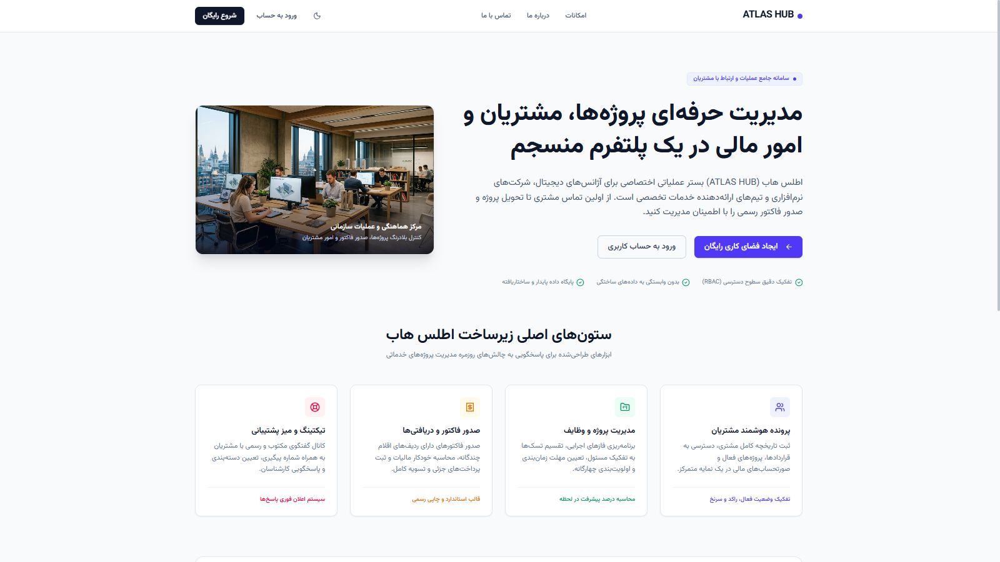
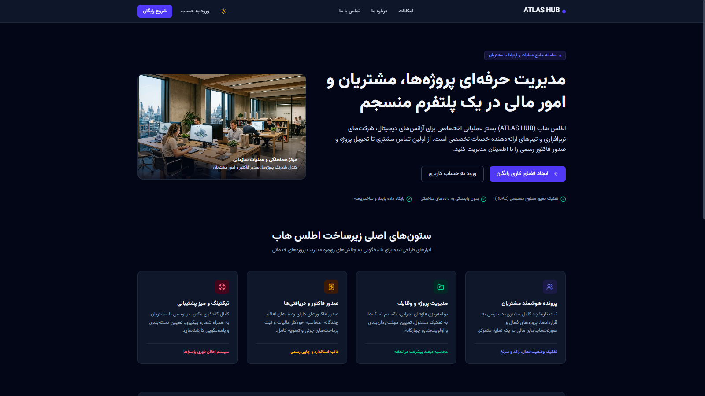
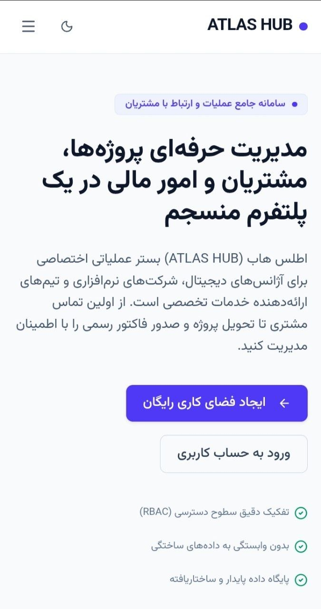
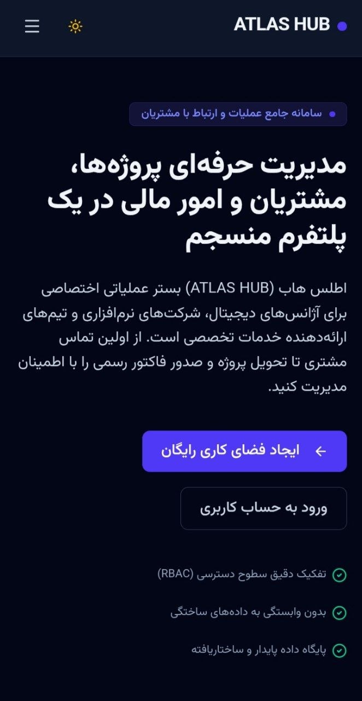

# Atlas Hub

Atlas Hub یک پلتفرم Full-Stack برای مدیریت عملیات کسب‌وکار، مشتریان، پروژه‌ها، وظایف، پشتیبانی و فاکتورهاست. این پروژه نمونه‌ای واقعی برای نمایش React، TypeScript، Node.js، REST API، طراحی دیتابیس، Authentication و RBAC است.

## معرفی پروژه

این سامانه برای تیم‌ها و شرکت‌های خدماتی طراحی شده است تا چرخه‌ی کار از ثبت مشتری و پروژه تا پیگیری وظایف، تیکت‌های پشتیبانی، فاکتورها و گزارش‌ها در یک محیط یکپارچه انجام شود. رابط کاربری فارسی، راست‌چین، responsive و دارای Light/Dark Theme است.

## 📸 Screenshots

تصاویر زیر از اجرای واقعی پروژه تهیه شده‌اند و نسخه‌ی Light و Dark را در desktop و mobile نشان می‌دهند.

### Desktop — Light



### Desktop — Dark



### Mobile — Light



### Mobile — Dark



## قابلیت‌های اصلی

- ثبت‌نام، ورود، Password Hashing با `bcrypt` و Authentication مبتنی بر JWT
- سازمان و اعضای سازمان، مدیریت مشتریان، پروژه‌ها و اعضای پروژه
- وظایف، تیکت‌های پشتیبانی و پیام‌های تیکت
- فاکتور، آیتم‌های فاکتور، پرداخت‌ها و گزارش‌های عملیاتی
- اعلان‌ها، تنظیمات حساب، تغییر رمز عبور و مدیریت تیم
- مرکز کنترل Admin، نقش‌ها و Audit Log
- Empty State، Loading State، Error State و Toastهای قابل استفاده‌ی مجدد
- Light/Dark Theme با persistence

## معماری سیستم

```text
React + TypeScript + Vite
            ↓
      REST API / Express
            ↓
   Authentication + RBAC
            ↓
 SQLite relational database
```

Frontend در `src/` و backend در `server/` قرار دارد. سرور Express در `server.ts` APIها و در production فایل‌های build شده‌ی Vite را سرو می‌کند. دیتابیس SQLite در مسیر runtime `data/` ساخته می‌شود و در Git نادیده گرفته شده است.

## ساختار پروژه

```text
src/                  React application
  api/                REST API clients
  components/         Layout و UI components مشترک
  context/            Auth، Theme و Toast state
  pages/              public، auth، app و admin pages
  types/              TypeScript domain types
server/src/routes/    endpointهای REST
server/src/middleware Authentication و RBAC
server/src/database   schema و اتصال SQLite
server/src/utils      auth، audit و notification utilities
tests/                تست‌های Authentication و database constraints
```

## Frontend

Frontend با React 19 و TypeScript ساخته شده است. Routing توسط `react-router-dom` انجام می‌شود و API clientها در `src/api` قرار دارند. Layoutهای public، workspace و control center جدا هستند و Button، Card، Input، Select، Textarea، Modal، Badge و EmptyState به‌صورت reusable پیاده‌سازی شده‌اند.

Theme با semantic CSS tokens پیاده‌سازی شده، بدون reload تغییر می‌کند و مقدار انتخاب‌شده را در `localStorage` با کلید `atlas_theme` نگه می‌دارد. در نبود انتخاب کاربر، preference سیستم‌عامل استفاده می‌شود.

## Backend

Backend با Node.js، Express و TypeScript اجرا می‌شود. APIهای auth، clients، projects، tasks، tickets، invoices، team، reports، notifications، admin و contact در route moduleهای جدا قرار دارند. درخواست‌های محافظت‌شده از middleware احراز هویت عبور می‌کنند و routeهای مدیریتی با RBAC محدود می‌شوند.

## احراز هویت و سطح دسترسی

- Registration و Login در `/api/auth`
- Password hashing با `bcryptjs`
- صدور و اعتبارسنجی JWT
- Authentication middleware برای APIهای خصوصی
- نقش‌های `ADMIN`، `MANAGER`، `TEAM_MEMBER` و `CLIENT`
- حفاظت backend برای Admin و منابع سازمانی
- تغییر رمز عبور با بررسی رمز فعلی
- ثبت عملیات مهم در Audit Log

بررسی سازمان و مالکیت منابع در routeهای مرتبط انجام می‌شود تا دسترسی به داده‌ی سازمان دیگر از طریق تغییر شناسه امکان‌پذیر نباشد.

### Roles & Access Control

- `ADMIN`: دسترسی مرکز کنترل و عملیات مدیریتی کل سیستم؛ تنها این نقش می‌تواند نقش `ADMIN` اختصاص دهد.
- `MANAGER`: مدیریت منابع عملیاتی سازمان، شامل مشتریان، پروژه‌ها، فاکتورها و اعضای تیم در محدوده‌ی سازمان.
- `TEAM_MEMBER`: دسترسی عملیاتی به منابع مجاز سازمان و انجام وظایف محول‌شده.
- `CLIENT`: دسترسی محدود به اطلاعات و تیکت‌های مرتبط با خود.

سطح دسترسی نهایی در backend بررسی می‌شود و صرفاً به کنترل‌های رابط کاربری وابسته نیست.

## پایگاه داده

پروژه از SQLite با API داخلی `node:sqlite` استفاده می‌کند. schema شامل users، organizations، organization_members، clients، projects، project_members، tasks، task_comments، support_tickets، ticket_messages، invoices، invoice_items، payments، notifications، audit_logs و contact_messages است.

Foreign keyها فعال هستند، برای روابط اصلی constraint وجود دارد و SQLite با WAL mode اجرا می‌شود. دیتابیس runtime در `data/atlas.sqlite` ساخته می‌شود و commit نمی‌شود.

## امنیت

- رمزهای عبور به‌صورت plaintext ذخیره نمی‌شوند.
- JWT secret از environment خوانده می‌شود.
- در production، نبودن `AUTH_SECRET` باعث توقف startup می‌شود.
- نقش‌ها و دسترسی‌ها در backend enforce می‌شوند.
- queryهای منابع سازمانی با `organization_id` محدود می‌شوند.
- Foreign key و check constraint برای داده‌ی معتبر استفاده شده‌اند.
- `.env`، دیتابیس محلی، `node_modules` و build output در `.gitignore` هستند.

برای production باید از secret تصادفی قوی، HTTPS، دیتابیس production و تنظیمات مناسب سرور استفاده شود.

## UI/UX و Responsive Design

رابط کاربری فارسی و RTL است و برای mobile، tablet و desktop طراحی شده است. کامپوننت‌های مشترک، spacing ثابت، focus state، فرم‌ها، empty state و Toast به نگهداری‌پذیری و تجربه‌ی کاربری کمک می‌کنند. Light و Dark Theme در صفحات عمومی، auth، workspace و control center پوشش داده شده‌اند.

## تست و کنترل کیفیت

```bash
npm install
npm run lint
npm run test
npm run build
```

تست‌های موجود hashing و verification رمز عبور، JWT و foreign keyهای relational database را بررسی می‌کنند. آخرین اجرای validation شامل ۲ suite و ۴ تست بود؛ هر ۴ تست موفق و بدون failure بودند.

## نصب و اجرا

```bash
npm install
copy .env.example .env
npm run dev
```

سرور development روی پورت `3000` اجرا می‌شود. برای production ابتدا build بگیرید و سپس با `NODE_ENV=production` سرور را اجرا کنید.

```bash
npm run build
npm run start
```

## متغیرهای محیطی

نمونه‌ی متغیرها در `.env.example` قرار دارد: `PORT`، `AUTH_SECRET` و `NODE_ENV`. مقدار واقعی secret نباید در Git، README یا source قرار بگیرد.

## 🤖 AI-Assisted Development

این پروژه با استفاده از AI-assisted development نیز توسعه و بررسی شده است. ابزارهای استفاده‌شده شامل Google AI Studio و OpenAI Codex بوده‌اند. استفاده از این ابزارها برای سرعت‌بخشیدن به پیاده‌سازی، audit و مستندسازی انجام شد و ساختار، تست، اجرای پروژه و بررسی نهایی به‌صورت عملی روی همین repository انجام شده است.

## وضعیت فعلی پروژه

Atlas Hub یک نمونه‌ی Full-Stack قابل اجرا و قابل بررسی است.

- Frontend: Ready
- Backend و REST API: Ready
- Authentication و RBAC: Implemented
- SQLite relational database: Implemented
- Responsive UI و Light/Dark Theme: Implemented
- Tests: 4 passing
- Production build: Passing
- Production deployment: نیازمند تنظیم secret، HTTPS و زیرساخت مقصد

## توسعه‌های آینده

- E2E test با browser automation
- migration versioning برای schema
- rate limiting و request validation متمرکز
- CI pipeline برای lint، test و build
- storage خارجی برای avatar و فایل‌های پیوست

## License

در حال حاضر license مشخصی به repository اضافه نشده است.
